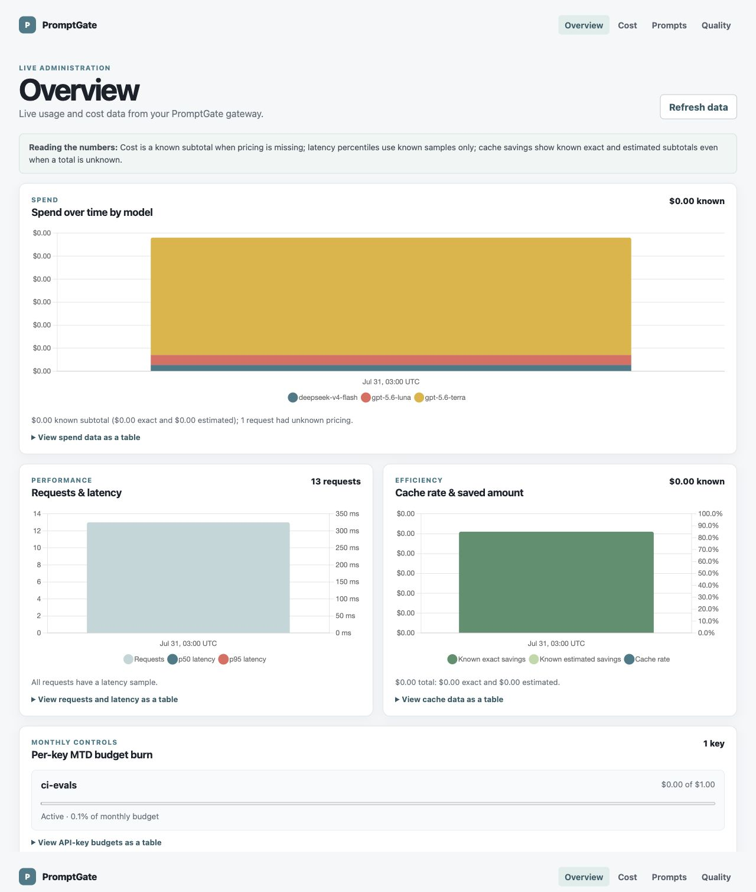
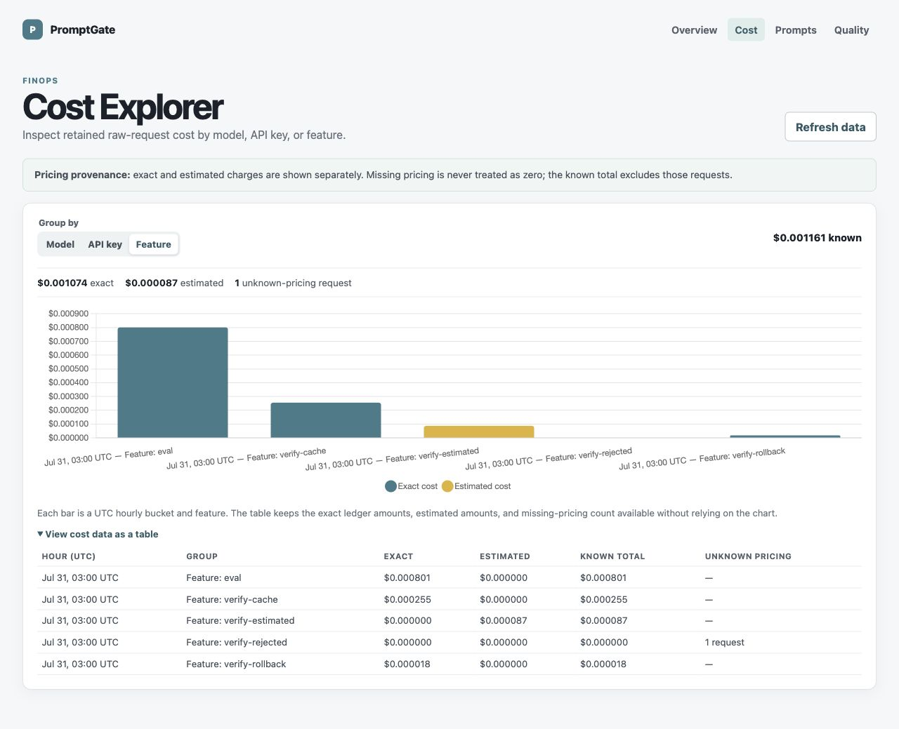
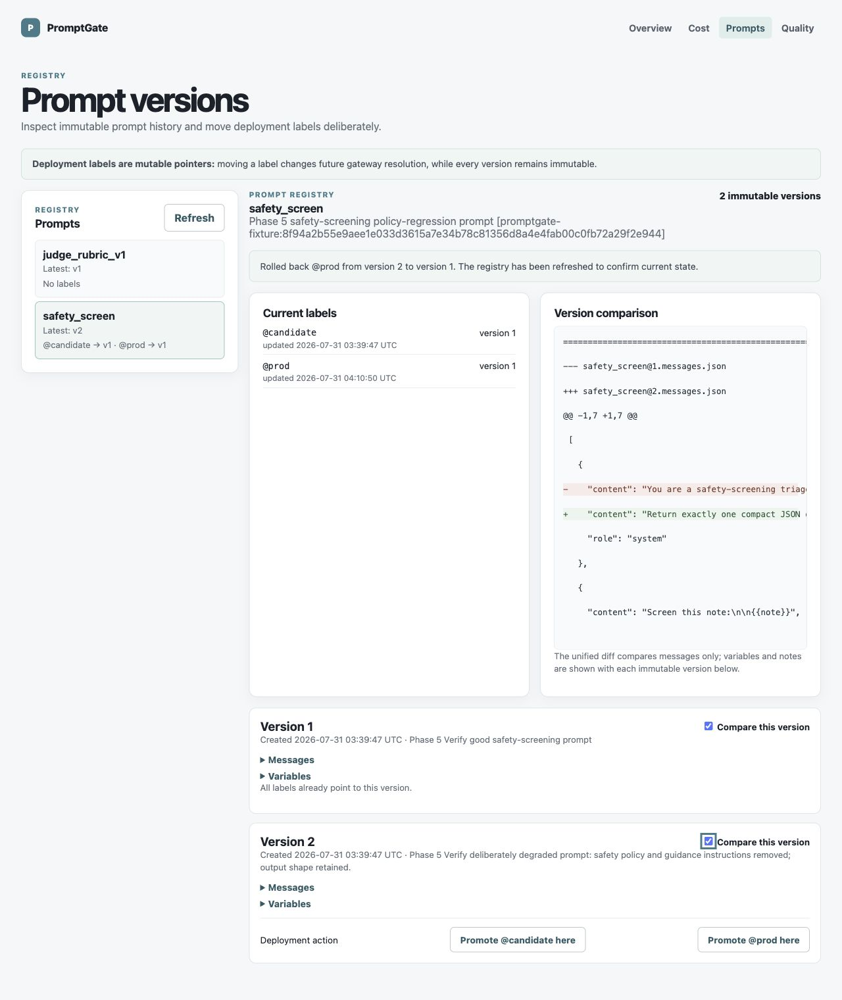
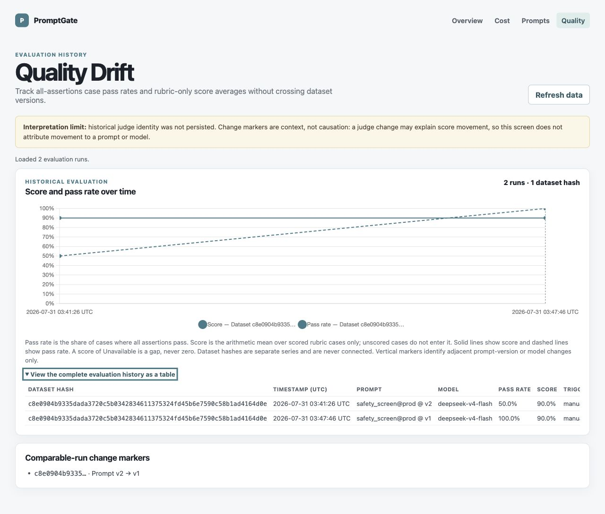
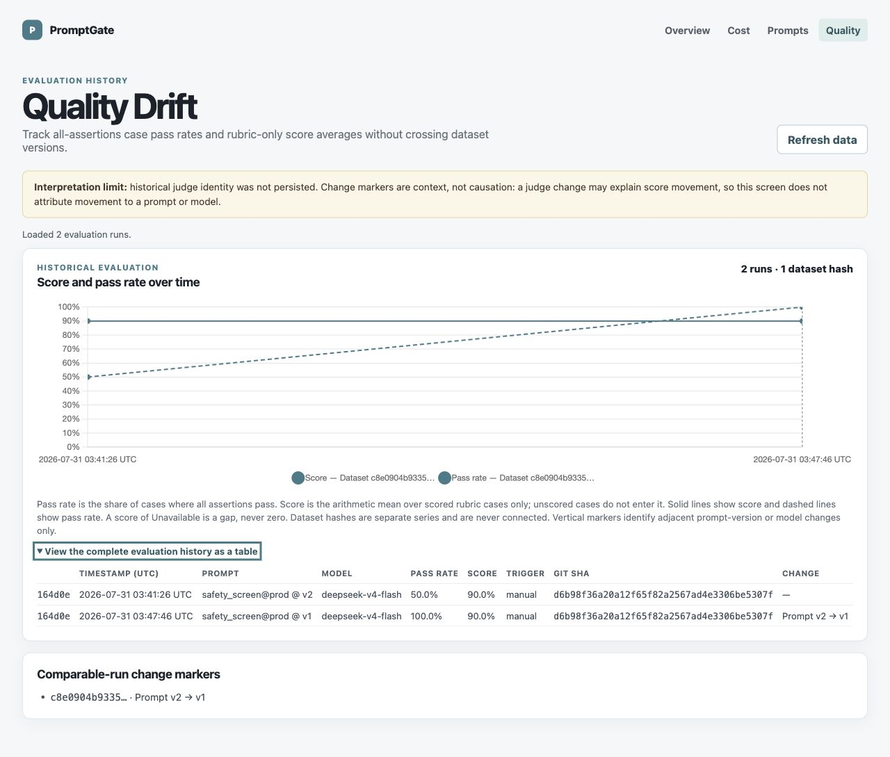

# Phase 7 verification evidence

Date: 2026-07-30

Status: **provider-free end-to-end Verify complete; awaiting explicit human
Phase 7 approval**. The production dashboard bundle and gateway ran locally
against a fresh temporary database with injected deterministic adapters. No
provider endpoint was reachable through those adapters, the evidence process
started under an empty environment with all four provider-key variables
absent, and no persistent project database was changed.

## Isolated verification environment

The Verify run used the documented `buildServer({ adapters })` seam with a
fresh temporary SQLite database and the real built Fastify/dashboard assets.
The injected adapters returned deterministic OpenAI-compatible responses:

- `deepseek-v4-flash` exposed the certified prompt-version difference: v2
  always returned `risk_level: none`, while v1 returned `urgent` for the
  chest-pain case;
- `gpt-5.6-terra` returned a fixed rubric result with `pass: true` and score
  `0.9`;
- `gpt-5.6-luna` omitted usage so the real gateway estimation path was
  exercised;
- every streaming method failed closed because streaming was outside this
  verification.

The real pricing seed and `pg-eval seed-ci` populated the isolated database.
A temporary loopback-only browser forwarder supplied the temporary admin
token to `/admin/api` after the verification browser dismissed the native
prompt. It did not alter application code or persist the token.

The exact retained inputs and harnesses are:

- [`provider-free-dataset.yaml`](phase-7/provider-free-dataset.yaml), whose
  SHA-256 is the durable dataset hash;
- [`provider-free-server.mjs`](phase-7/provider-free-server.mjs), which
  refuses to start when any approved provider-key variable is present;
- [`browser-token-proxy.mjs`](phase-7/browser-token-proxy.mjs), the
  loopback-only browser forwarder; and
- [`verify-transcript.txt`](phase-7/verify-transcript.txt), with sanitized
  launch/reproduction commands, exact eval and traffic outputs, browser
  assertions, the value-blind provider-variable guard output, and exact
  post-shutdown read-only database assertions.

## Same-hash rollback proof

The exact same two-case dataset file, target model, prompt reference, and
judge behavior were used on both sides of the rollback. Both durable
`eval_runs` rows carry dataset hash
`c8e0904b9335dada3720c5b0342834611375324fd45b6e7590c58b1ad4164d0e`.

Before the UI action, `safety_screen@prod` resolved to deliberately degraded
version 2:

```text
| case               | model              | pass | score |
|--------------------|--------------------|------|-------|
| urgent_chest_pain  | deepseek-v4-flash | fail |       |
| benign_recovered   | deepseek-v4-flash | pass | 0.9   |
```

The Prompts screen then performed its real confirmation-gated **Roll back
@prod here** action. The refreshed registry reported:

```text
Rolled back @prod from version 2 to version 1.
```

The same direct chest-pain request changed from `risk_level: none` at v2 to
`risk_level: urgent` at v1. The same eval command then produced:

```text
| case               | model              | pass | score |
|--------------------|--------------------|------|-------|
| urgent_chest_pain  | deepseek-v4-flash | pass | 0.9   |
| benign_recovered   | deepseek-v4-flash | pass | 0.9   |
```

A read-only post-shutdown database assertion confirmed:

- resolved rollback request versions `[2, 1]`;
- paired pass rates `[0.5, 1.0]`;
- paired rubric score averages `[0.9, 0.9]`;
- identical dataset hash, `safety_screen@prod` reference, and
  `deepseek-v4-flash` model;
- latest `prod` label history move `2 → 1` and current `prod` version `1`.

This proves the Quality Drift marker is a comparable same-hash prompt-version
change. The stable score beside a changed pass rate also proves that the
screen keeps all-assertions pass rate distinct from rubric-only score.

## Cost-provenance proof

Controlled local requests exercised each required retained-row state. The
read-only database assertions and Cost Explorer agreed:

| Feature | Durable result |
|---|---|
| `verify-cache` | first request exact cost 255 micro-USD; second request cache hit with zero cost and 255 exact saved micro-USD |
| `verify-estimated` | 87 micro-USD with `cost_estimated = 1` |
| `verify-rejected` | `prompt_var_missing`, null cost, shown as one unknown-pricing request |
| `verify-rollback` | exact 9 micro-USD at v2 and exact 9 micro-USD at v1 |

No missing price was represented as zero, and exact and estimated subtotals
remained separate in both text and table output.

## Browser evidence

The four production screens loaded only authenticated live data. At the
1280-pixel verification viewport, every screen had
`scrollWidth === clientWidth`; the browser console contained no warnings or
errors. Prompt/version interactions retained focus, the Quality history table
is a labeled `tabindex="0"` scroll region, chart semantics have complete table
alternatives, and the dashboard source/bundle contains no
`localStorage`, `sessionStorage`, `document.cookie`, or `cookieStore`
references.



**Overview:** 13 retained requests populate all four required panels. The
known-cost disclosure keeps the one unknown-pricing request visible.



**Cost Explorer:** feature grouping visibly separates exact cost, estimated
cost, and the rejected request whose price is unknown; the expanded table
preserves the integer-ledger values.



**Prompts:** `@prod` and `@candidate` both point to immutable v1 after the
confirmed rollback; the success notice, both immutable version cards, selected
comparison, and the remaining v2 deployment actions are visible together.



**Quality Drift:** two runs in one dataset-hash partition show pass rate
moving from 50% to 100% while score remains 90%, with a `Prompt v2 → v1`
marker and the required missing-judge/non-causation disclosure.



**Quality table detail:** the keyboard-scrollable table's right side exposes
the 50%/100% pass rates, both 90% scores, the shared model and Git SHA, and the
`Prompt v2 → v1` change column without claiming that one viewport can display
all horizontally scrollable columns at once.

## Acceptance

| Phase 7 Verify criterion | Result |
|---|---|
| Overview shows spend, latency, cache, and budget data | pass |
| Cost Explorer groups by feature and preserves exact/estimated/unknown provenance | pass |
| Prompts shows immutable history/diff and performs a truthful confirmed rollback | pass |
| Quality Drift partitions by dataset hash and marks the comparable v2 → v1 change | pass |
| Browser console, horizontal overflow, focus, and table alternatives | pass |
| No persistent browser credential storage | pass |
| No provider calls; provider-key variables absent under the value-blind launch guard; no persistent project-data mutation | pass |
| Temporary gateway/forwarder stopped gracefully; durable assertions opened the temporary database read-only | pass |

There is no remaining Phase 7 Verify blocker. Publication still requires the
normal full repository gate and the single protected Phase 7 pull request.
