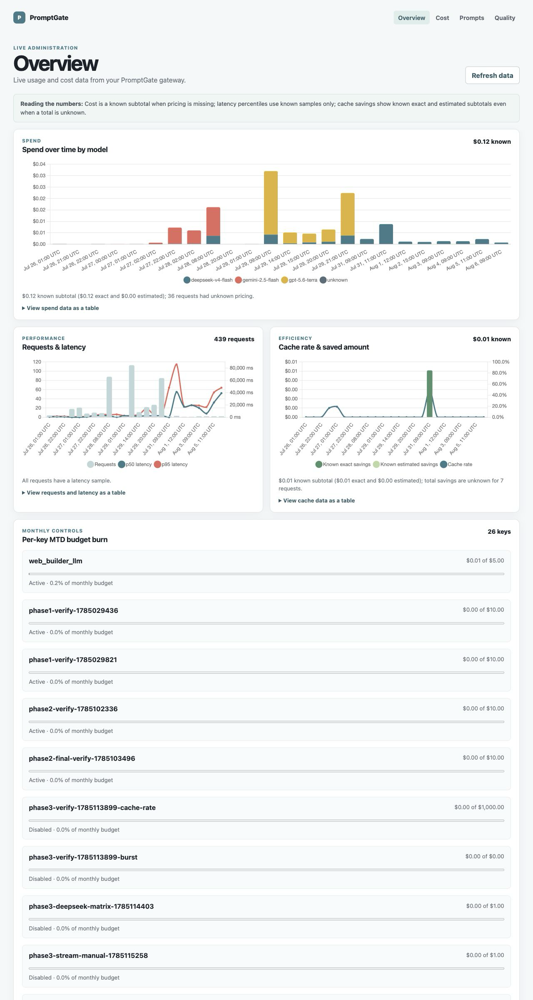
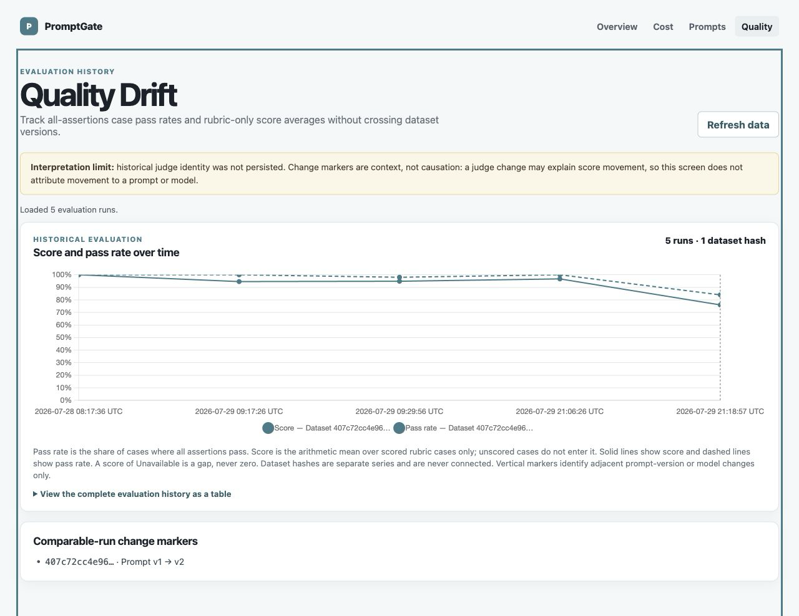

# Phase 8 evidence

Date started: 2026-07-30

Status: **in progress — steps 1–6 and the required first green
schedule-triggered run are complete; the seven-day window passed with
registry-backed traffic on all seven days and successful qualifying traffic on
six; exact final-merge deployment verification, the literal final Verify, and
owner approval remain**.

## Step 1 — persistent deployment and dogfood key

Phase 7 publication was complete before Phase 8 started:

- protected PR #12 refreshed both ordinary `ci` checks successfully;
- its same-version live evaluation passed in 13m13s;
- cleanup and aggregate `eval-gate` passed;
- the PR merged as `6f2d44ea2bcf118eccabb815d2fd459f4097bfb0`.

The Phase 8 branch was created from that exact merge. The pre-step repository
baseline passed all 852 tests in 67 files.

The exact merged Compose image was built and deployed on the host that contains
`web_builder_llm`:

```text
image_id=sha256:1070c675c80190765e3bc03ff778592bfb47ae89d3e1a5267fc9da34b737ccea
container=promptgate-gateway-1
listen=127.0.0.1:8787
status=running
health=healthy
database=existing persistent ./data/promptgate.db
```

The local `.env` was tightened to mode `0600`. Before the one-time key-creation
request, the process reserved an empty ignored handoff at
`data/web_builder_llm.key` with mode `0600`. It then created and re-read this
safe metadata:

```json
{
  "id": 26,
  "name": "web_builder_llm",
  "budget_micro_usd_month": 5000000,
  "rate_limit_rpm": 60,
  "disabled": false,
  "month_to_date_spend_micro_usd": 0
}
```

The 51-byte plaintext key was written directly to that ignored owner-only
handoff and was never emitted to output, logs, Git, or shell arguments. The
retained key authenticated successfully against `/v1/models`, which returned
six currently effective routed models.

An authenticated request-count query covering the Phase 7 merge through
`2026-07-31T05:12:59Z` returned `points: []` and total request count zero. Thus
image startup, health, admin metadata, and key-authentication checks caused no
provider request. No provider endpoint was called in step 1.

Final lint checked 178 files, all 852 tests in 67 files passed, Compose
configuration and diff checks passed, and the healthy container retained
restart count zero. A fresh independent read-only audit verified the exact
branch/diff, image/container/mount, ignored owner-only credential files, safe
key metadata, zero request-count metrics through `05:15:42Z`, and absence of a
tracked or container-logged `pg-*` key literal, then returned `APPROVE`.

## Step 2 — finished-repository contract resolution

The target repository is available at:

```text
/Users/f8fq/coding projects/Finished/web_builder_llm
commit=1fe570bb175834107409739703e03efdd5805fc2
branch=main
```

Its tracked source was clean. The unrelated pre-existing untracked
`TECH_STACK.md` was preserved, and no source, runtime, or Git state in that
repository changed.

### Provider configuration

`LlmProviderRegistry` loads an app-level JSON file selected by
`LLM_PROVIDERS_CONFIG` or `site.llm.providers.config`. Provider replacement is
whole-definition rather than merged, config stores an environment-variable name
rather than a literal key, and the normal key precedence is request-typed,
encrypted locally saved, then the named environment variable.

The retained secret-free definition is
`docs/evidence/phase-8/web-builder-promptgate-provider.json`. It specifies:

```text
providerId=promptgate
apiFamily=OPENAI_CHAT
authScheme=BEARER
baseUrl=http://127.0.0.1:8787/v1
defaultEnvKey=PROMPTGATE_API_KEY
jsonStrategy=NATIVE_JSON_OBJECT
defaultModels=[deepseek-v4-flash]
```

The repository blocks loopback/private base URLs by default as a key-exfiltration
defense. This trusted same-host deployment must therefore launch with the
explicit Spring property `site.llm.allowPrivateBaseUrls=true`.

### `GET /v1/models`

The app does call the endpoint, but not at startup or ordinary provider
selection:

1. OpenAI-compatible key validation sends an authenticated
   `GET {baseUrl}/models`.
2. After successful validation, the frontend performs its live-model lookup
   through `/api/models`; `ModelController` asks the same client for its model
   list, causing a second authenticated `GET {baseUrl}/models`.
3. A failed or empty live listing falls back to the configured default models.

For the retained definition, the exact upstream URL is
`http://127.0.0.1:8787/v1/models`.

### Tools and streaming truthfulness

The PromptGate-facing `OpenAiChatLlmClient` sends no tools. Its request contains
the selected model, one user message, `response_format: {"type":"json_object"}`,
and optional sampling fields. The native Anthropic client is the separate path
that sends tools, already resolved and implemented in Phase 2.

The inspection exposed an authority mismatch in the then-current wording. The finished app's OpenAI
Chat client uses a buffered string response and does not send `stream: true`.
Its documented SSE endpoint replays progress events only after synchronous
generation has completed; it is not provider-token streaming. Before Amendment
A, Phase 8 step 3 could not truthfully claim the live token-streaming UX check
as then worded, and the phase had no literal final Verify block even though the
orchestrator requires one for every phase.

The resulting narrow synchronized amendment:

- verifies the existing buffered generation/progress UX without claiming
  provider-token streaming; and
- adds a literal Phase 8 Verify block covering at least seven days of durable
  `web_builder_llm` rows, normal generate/edit success through PromptGate,
  registry `pg_prompt` use plus rollback proof, Overview/Drift screenshots and
  required figures, the scheduled contract result with missing credentials
  named `SKIPPED`, and README deliverable links.

### Opus/max authority verdict

Per the project owner's escalation instruction, Claude Opus at max effort
reviewed the supplied authority and source facts. Its verdict was
`PROCEED WITH ADJUSTMENTS`.

The review rejected implementing token streaming in `web_builder_llm` because
that would widen Phase 8 into a new transport feature in a separate finished
application. It recommended:

- clarify step 3 as the existing buffered request/response plus post-completion
  progress replay, and assign token-stream proof to contract-nightly;
- report missing provider credentials as named skips, fail a configured
  provider's contract break red, and fail if zero providers are configured;
- make the registry `pg_prompt` live before opening the seven-day observation
  window;
- state the cache-savings formula and direct-vs-proxied p95 method so cache hits
  cannot make proxy overhead look artificially favorable; and
- add a literal Verify block covering deployment/key cap, resolved TODOs,
  buffered normal flows and durable rows, live `pg_prompt`, the observation
  window, dashboard screenshots/figures, rollback evidence, scheduled contract
  evidence, README links, and final owner approval.

## Owner-approved Truthfulness and Verify Amendment A

On 2026-07-31, the project owner explicitly approved Phase 8 Truthfulness and
Verify Amendment A. `BUILD_PLAYBOOK.md`, `IMPLEMENTATION_GUIDE.md`,
`PROGRESS.md`, and this evidence file are synchronized under that authority.
The project idea remains unchanged.

The approved contract:

- verifies `web_builder_llm`'s existing buffered request/response plus
  post-completion progress replay in normal generate/edit flows, without
  claiming provider-token streaming or adding a new transport feature;
- assigns live streaming and non-streaming adapter proof to
  `contract-nightly.yml`;
- reports every missing credential as a named `SKIPPED` provider, makes any
  configured provider contract failure red, and makes zero configured
  providers red;
- requires the registry-backed `pg_prompt` call to be live before the
  observation window starts;
- requires at least seven consecutive calendar days with the registry-backed
  path live and at least one real dogfood request on five of those days;
- calculates cache dollars saved as the sum of retained
  `cache_saved_micro_usd` over known cache-hit rows, with exact and estimated
  sums separate and the count of excluded unknown legacy hits reported
  separately;
- calculates gateway p95 overhead as proxied p95 minus direct p95 with the same
  model, prompt, sample size, and measurement window while excluding cache
  hits;
- proves rollback through a confirmed registry-label change and the next live
  dogfood call/version; and
- adds the literal final Verify block covering the healthy deployment and $5
  key, resolved TODOs, buffered normal flows and rows, live `pg_prompt`,
  observation evidence, screenshots and figures, a green schedule-triggered
  contract run, README links, and final owner approval.

### Amendment validation

The synchronized amendment passed the repository gate:

```text
lint: 179 files checked
tests: 67 files, 852 tests passed
compose configuration: valid
git diff check: clean
```

An independent read-only audit initially found stale guide TODO/risk wording,
pre-amendment evidence written in the present tense, and a missing requirement
to report the count of unknown legacy cache hits separately. Those findings
were corrected. The fresh re-audit checked the complete diff against every
approved Amendment A element and returned `APPROVE`.

## Step 3 — buffered dogfood verification and lifecycle recovery

The normal external flow ran through the real built PromptGate deployment and
the finished app's existing UI. The original finished repository remained
unchanged at tracked commit
`1fe570bb175834107409739703e03efdd5805fc2`, including its unrelated
pre-existing untracked `TECH_STACK.md`. To avoid changing that repository, an
ignored local clone under PromptGate's `data/` directory supplied the dogfood
runtime. Its only external-app correction makes the OpenAI Chat request timeout
configurable, keeps the 90-second default, and uses 135 seconds for this
dogfood deployment. The isolated external suite passed all 377 tests, and an
independent review returned `APPROVE`; the local clone records the change as
`5335d9f`.

The first PromptGate generation used the exact prompt:

```text
Phase 8 dogfood 2026-07-31: Create a compact single-page landing page for a fictional neighborhood bike repair shop named Copper Spoke. Include a hero, three services, business hours, and a contact call to action. Use accessible high-contrast colors. Text only; do not request or generate images.
```

It created project `0036b6e2b6254e1795313ac555032eb0` and immutable active
snapshot `2f03a5dae74b4e3f8494cb112c93f96e`. The app visibly replayed `START`,
provider `STATUS`, `TOKEN_COUNT`, and `DONE` only after the buffered provider
call completed. PromptGate retained request row 425 with request ID
`39c2467d-b392-452c-af6c-450733f0a0aa`, model `deepseek-v4-flash`, 574 input
tokens, 7,962 output tokens, exact cost 2,309 micro-USD, cache miss,
non-streaming status, `ok`, and 48,141 ms total latency.

The first edit used this exact prompt:

```text
Phase 8 dogfood edit 2026-07-31: Add a compact accessible FAQ section with exactly three questions below the business hours. Keep all existing sections and remain text-only.
```

That attempt exposed two independent timeout/lifecycle facts:

1. `web_builder_llm` stopped waiting at its fixed 90-second timeout before
   PromptGate's 120-second upstream timeout, so the UI reported failure even
   though the provider later completed.
2. PromptGate's non-streaming persistence depended on Fastify `onResponse`.
   Once the client disconnected, that hook did not retain a row or reconcile
   the in-memory budget reservation for the completed provider response.

The response still populated PromptGate's cache with an exact priced value of
5,089 micro-USD. There was no corresponding request row anywhere in the live
database. That cache-entry/row mismatch is retained as proof of one known
pre-fix orphaned provider completion; no synthetic row was inserted and no
historical spend was backfilled.

After the narrow external timeout correction, repeating the edit returned the
already-completed cached result in 33 ms. It created snapshot
`e90ee6af4ef04b1eb5ac8c4d46f71679`, retained row 426 with request ID
`cd6ca2e6-9a6e-45b4-821a-8e09a62bbc93`, 2,668 input and 16,838 output tokens,
cache hit, exact saved cost 5,089 micro-USD, zero charged cost, non-streaming
status, and `ok`. The page retained every prior section and contained exactly
three FAQ questions. The app again replayed the four progress events only after
completion; this is buffered UX proof, not token-streaming proof.

### Lifecycle correction

PromptGate commit `f6cd9fa335ebfed300018b5d8de9c156917e2a74`
(`fix: persist buffered disconnect outcomes`) makes non-streaming disconnect
settlement explicit. A client disconnect now aborts the upstream operation,
persists exactly one `client_aborted` row with conservative prompt-only
estimated metering when no completion was received, and reconciles the budget
only after durable logging. Buffered success and cache-hit flushes release
their lifecycle state. First-cause semantics preserve an earlier
`provider_error` or timeout if the client disconnects during cleanup. Adjacent
pre-header streaming timeout/provider-error cleanup received the same
first-cause protection.

Seven real-loopback regressions cover the corrected lifecycle paths. The final
focused suite passed 71/71, lint checked 179 files, the exact clean-build
repository run passed all 859 tests in 67 files, all packages built, Compose
configuration was valid, and diff checks were clean. Earlier non-authoritative
full runs encountered unrelated five-second load-test scheduling timeouts and,
once, stale/missing generated eval artifacts; the affected isolated tests were
green, and the clean build followed by the exact full test command is the
authoritative result.

Docker Desktop failed while the persistent deployment was being inspected and
the old container exited 255. A controlled Docker Desktop restart restored the
engine. Before rebuilding, the old image was started once and its admin API
proved the persistent database was intact: key 26 still had its exact $5 cap
and the two durable rows above. No host-side SQLite connection was opened while
the gateway was live. The exact corrected source was then rebuilt and
force-recreated as:

```text
commit=f6cd9fa335ebfed300018b5d8de9c156917e2a74
image_id=sha256:b0b39a7bffe71e7a4b7e3ffd9231d3ad470175edffca9ff362fcd12c61a4e0b8
container=promptgate-gateway-1
listen=127.0.0.1:8787
status=running
health=healthy
restart_count=0
database=existing persistent ./data/promptgate.db
```

The post-fix live edit used the unique prompt:

```text
Phase 8 post-fix accounting 2026-07-31-A: Add one short visible sentence reading exactly 'Walk-ins welcome.' immediately before the contact call to action. Preserve every existing section, including exactly three FAQ questions, and remain text-only.
```

The app remained in `Applying edit…` with no progress events while the
buffered call ran, then succeeded with snapshot
`18e7ea04b0ce487c9a6ef0937a4726fc`, parent
`e90ee6af4ef04b1eb5ac8c4d46f71679`. The page preserved exactly three FAQ
questions and visibly added `Walk-ins welcome.` in the requested position.
Only after completion did the UI replay `START`, provider `STATUS`,
`TOKEN_COUNT`, and `DONE`.

PromptGate durably retained row 427 with request ID
`f02b20d9-75c1-4320-a1ca-cf56f07bb2ad`, model
`deepseek-v4-flash`, 3,157 input and 15,968 output tokens, exact cost 4,913
micro-USD, cache miss, non-streaming status, `ok`, and 85,962 ms total latency.
The row's prompt ID/version are null as expected before step 4 introduces the
registry-backed request. Safe key metadata then showed the key enabled at its
unchanged 60 RPM and 5,000,000-micro-USD monthly cap with 7,222 micro-USD
retained month-to-date spend.

### Truthful accounting and direct comparison

At the step boundary, the live database therefore contains exactly three
durable dogfood rows: two uncached successful rows and one cached successful
row. Retained spend is 7,222 micro-USD. Known exact cache savings are 5,089
micro-USD, with zero estimated savings and zero unknown legacy cache-hit rows.
Separately, the known pre-fix orphaned provider completion cost 5,089
micro-USD, so known provider-priced completions total 12,311 micro-USD. The
retained month-to-date ledger omits that orphan; the two figures must not be
presented as equivalent.

A separate direct `deepseek/deepseek-chat` generation used the exact original
generation prompt and created project `541e5c1614324eacbd40da50c9e17b65`
with active snapshot `73ff498ff04c4ebca266860065952050`. It showed the same
buffered UX: no progress events while generating, then the four events replayed
after completion. Because the direct provider/model identity is not the same as
PromptGate's routed `deepseek-v4-flash`, this call is only a buffered-behavior
control and is excluded from the Amendment A matched p95 calculation.

A fresh independent read-only evidence/security audit verified the source,
clean-build 859-test gate, exact live image and persistent mount, safe key
metadata, rows 425–427, retained spend/savings, separate orphan disclosure,
untouched original repository, isolated timeout patch, p95 exclusion, and
closed observation window. It found no credential leakage or overclaim and
returned `APPROVE`.

Step 4 then put `web_builder_request@prod` live, proved a version-label canary
and rollback with the next dogfood call, and opened the seven-day observation
window only after the rolled-back call succeeded.

## Step 4 — live registry prompt, canary, and rollback

The app integration was made only in the ignored dogfood clone. External commit
`ff47ea8fc8af17933b0ec5a2f0742c6f942324d3` changes the OpenAI Chat request
body only when the normalized provider ID is exactly `promptgate`:

```json
{
  "model": "deepseek-v4-flash",
  "messages": [],
  "pg_prompt": "web_builder_request@prod",
  "pg_vars": {
    "request_prompt": "<the complete generate, edit, or repair prompt assembled by web_builder_llm>"
  },
  "response_format": {
    "type": "json_object"
  }
}
```

Every other OpenAI-compatible provider retains exactly one user message and no
`pg_prompt`/`pg_vars` fields. The response format, sampling, authentication,
135-second dogfood timeout, retry policy, and buffered transport are unchanged.
Focused request-shape tests passed 33/33; the complete external suite passed
380/380 with zero failures, errors, or skips; packaging passed; and the clone
was clean at the commit. A fresh independent read-only audit rechecked
generation, modification, repair/re-ask, direct-provider isolation, preserved
transport behavior, the untouched original repository, and the green gates,
then returned `APPROVE`.

Before restarting the patched app, the authenticated admin API created registry
prompt ID 4:

```text
slug=web_builder_request
description=Registry-owned request envelope for web_builder_llm dogfood traffic.
```

Version 1 is the long-term direct-equivalent baseline:

```json
{
  "messages_json": [
    {
      "role": "user",
      "content": "{{request_prompt}}"
    }
  ],
  "variables_json": [
    {
      "name": "request_prompt",
      "required": true,
      "description": "The complete generate, edit, or repair request assembled by web_builder_llm."
    }
  ],
  "notes": "Phase 8 baseline: direct-equivalent one-user-message envelope."
}
```

Version 2 is the bounded rollback canary. It prepends this system message before
the same required user variable:

```text
Check the supplied request carefully and preserve every requested section and
accessibility constraint while obeying its structured-output contract.
```

Its notes are `Phase 8 canary used only to prove label deployment and
rollback.` The plain-text diff endpoint showed only that additional system
message. The first label write bound `prod` from no prior version to v2; an
in-container read-only query confirmed label-history row 8
(`null → 2`, `2026-07-31 11:34:42` UTC).

The patched app was then restarted once. No app restart or client-code change
occurred between the canary and rollback calls. Both used this exact visible
modification request:

```text
Phase 8 registry rollback proof 2026-07-31-R1: Ensure the footer contains exactly one visible sentence reading 'Repairs made neighborly.' Preserve every existing section, including exactly three FAQ questions and the visible 'Walk-ins welcome.' sentence, and remain text-only.
```

### Canary call — `prod → v2`

The UI showed `Applying edit…` without progress events while the buffered call
ran, then replayed `START`, provider `STATUS`, `TOKEN_COUNT`, and `DONE` after
completion. It created immutable edit snapshot
`e7c6baee0890440dae42584af5a21544`, parent
`18e7ea04b0ce487c9a6ef0937a4726fc`, titled
`Copper Spoke Footer Rollback`, at `2026-07-31T11:39:01.780062Z`.

Durable row 428 proves the live registry resolution:

```text
request_id=3080499a-df66-4995-8d5f-081d2eca3fe1
key=web_builder_llm
provider=deepseek
model=deepseek-v4-flash
prompt_id=4
prompt_version=2
cache_hit=0
streamed=0
input_tokens=3195
output_tokens=7593
cost_micro_usd=2573
cost_estimated=0
status=ok
error_code=null
total_ms=41173
```

The rendered page contained exactly one `Repairs made neighborly.` sentence,
one `Walk-ins welcome.` sentence, and three FAQ disclosure elements.

### Confirmed rollback and next call — `prod → v1`

After row 428 was verified, the authenticated label write returned exactly
`from_version: 2` and `to_version: 1`. A detail read confirmed current
`prod = 1`; read-only label history confirmed row 9
(`2 → 1`, `2026-07-31 11:39:46` UTC).

The exact same visible app prompt was the next dogfood call. It succeeded
without an app restart and created immutable edit snapshot
`1b84dc94357c428886a862779aeaad9d`, parent
`e7c6baee0890440dae42584af5a21544`, titled
`Copper Spoke Footer Verification`, at
`2026-07-31T11:40:15.829925Z`. Durable row 429 proves that next call served the
rolled-back version:

```text
request_id=52f3cd46-38ff-4dfe-8231-e35d425d0447
key=web_builder_llm
provider=deepseek
model=deepseek-v4-flash
prompt_id=4
prompt_version=1
cache_hit=0
streamed=0
input_tokens=3167
output_tokens=3476
cost_micro_usd=1311
cost_estimated=0
status=ok
error_code=null
total_ms=20834
```

The v1 UI again replayed the four progress events only after completion. The
v2 and v1 snapshots each contain exactly one required footer sentence, one
`Walk-ins welcome.` sentence, and three FAQ elements. Their two output files
are byte-identical:

```text
index.html sha256=82eaf1ab4c8684ec1ccc3aa19b99a295d59e4f0fa073b6c8587413b66dda973d
styles.css sha256=df66c49008b5e3685654d6fd6af9476e0f6cf62295979973e7b750e3d8f352dd
```

Thus the served prompt version changed without changing the client call site,
while the requested page semantics remained stable. `prod` is intentionally
left at v1.

### Observation-window opening state

The successful rolled-back v1 call opens the seven-consecutive-calendar-day
window on 2026-07-31. The inclusive target window is 2026-07-31 through
2026-08-06, and 2026-07-31 is day 1 with real registry-backed traffic. At least
four additional distinct calendar days in that window still need a real
dogfood request.

Active thread heartbeat `phase-8-dogfood-observation` checks once daily at
09:00 local time through 2026-08-06. It first performs a read-only durable-row
preflight and never sends duplicate traffic on a day that already qualifies.
When a day has no qualifying row, it sends at most one date-unique, idempotent,
text-only edit through the normal external app path; requires an `ok`,
non-streaming prompt-ID-4/version-1 row; and records an independently audited
green observation-day commit. It leaves `prod` at v1, preserves the $5/60-RPM
key, never changes registry versions or the original finished repository, and
notifies the owner only on a failed run/manual blocker.

At opening, key 26 remains enabled with its exact 60 RPM and 5,000,000
micro-USD monthly cap. It has five durable dogfood rows, retained spend 11,106
micro-USD, exact cache savings 5,089 micro-USD, zero estimated cache savings,
and zero unknown legacy cache-hit rows. Including the explicitly separate
pre-fix orphan, known provider-priced completions total 16,195 micro-USD.

A fresh independent read-only Step 4 evidence/security audit reconciled the
external commits and original repository, exact healthy gateway image,
registry definitions/current label/history, consecutive rows 428/429, one
unchanged app process, snapshot parent chain/timestamps/token counts, rendered
content counts, byte-identical file hashes, retained and orphan-inclusive
accounting, and observation-window date math. It found no credential disclosure
or material overclaim and returned `APPROVE`.

### Observation day 2 — 2026-08-01

The daily read-only database preflight found no successful
`web_builder_llm` row for local calendar day 2026-08-01 attributed to prompt
ID 4/version 1, so the duplicate-prevention gate allowed one request. The exact
corrected PromptGate image remained healthy with restart count zero and
`web_builder_request@prod` still resolved to immutable v1. The ignored dogfood
clone was not listening on loopback; it was safely restarted from its clean
external commit `ff47ea8fc8af17933b0ec5a2f0742c6f942324d3` with owner-only ignored
runtime credentials, without printing either key.

Exactly one normal edit request was then sent through the external app's
`/api/projects/{projectId}/edit` path for existing Copper Spoke project
`0036b6e2b6254e1795313ac555032eb0`. Its date-unique text-only prompt was:

```text
Phase 8 observation day 2 2026-08-01: Ensure the footer still contains exactly one visible sentence reading 'Repairs made neighborly.' Preserve every existing section, exactly three FAQ questions, and the visible 'Walk-ins welcome.' sentence. Make no other content changes and remain text-only.
```

The synchronous request began at `2026-08-01T12:39:12.620Z`, returned HTTP
200 at `2026-08-01T12:39:30.532Z`, and completed job
`bc16a6d80b79426293fad8bc1de4cb08`. A post-completion event read returned
`START`, `STATUS`, `TOKEN_COUNT`, and `DONE` in order, with `DONE` at
`2026-08-01T12:39:30.498263Z`; this remains buffered completion with
post-completion progress replay, not provider-token streaming. Exactly one new
edit snapshot, `eb1bf72cd15a47c39630a92c509e4d18`, was created from parent
`1b84dc94357c428886a862779aeaad9d` with 3,171 input tokens, 3,114 output
tokens, and 6,285 total tokens.

Read-only in-container database verification found exactly one qualifying row
for the day:

```text
id=430
ts=2026-08-01 12:39:30 UTC
request_id=25161b44-9e21-43a3-b7c3-fe04bb119f48
key=web_builder_llm
provider=deepseek
model=deepseek-v4-flash
prompt_id=4
prompt_version=1
cache_hit=0
streamed=0
input_tokens=3171
output_tokens=3114
cost_microusd=1158
cost_estimated=0
cache_saved_microusd=0
status=ok
error_code=null
total_ms=17188
```

The resulting snapshot contains exactly one `Repairs made neighborly.`
sentence, exactly one visible `Walk-ins welcome.` sentence, and exactly three
FAQ `<details>` elements. Its `index.html` and `styles.css` are byte-identical
to the parent snapshot and retain the expected hashes:

```text
index.html sha256=82eaf1ab4c8684ec1ccc3aa19b99a295d59e4f0fa073b6c8587413b66dda973d
styles.css sha256=df66c49008b5e3685654d6fd6af9476e0f6cf62295979973e7b750e3d8f352dd
```

Prompt ID 4 still has only immutable v1/v2, `prod` remains v1, and label
history remains exactly `null → 2` then `2 → 1`. Key 26 remains enabled
at 60 RPM with its 5,000,000-micro-USD monthly cap. Across six retained
dogfood rows, retained spend is now 12,264 micro-USD; exact cache savings
remain 5,089 micro-USD, estimated cache savings remain zero, and unknown
legacy cache-hit rows remain zero. Adding only the separately disclosed exact
5,089-micro-USD pre-fix orphan yields 17,353 micro-USD of known
provider-priced completions; it is not represented as retained spend.

The window now proves qualifying traffic on 2026-07-31 and 2026-08-01: day
2/7 of the exact span and 2/5 required distinct traffic days are complete. At
least three more distinct days still need a qualifying request, and the window
must remain open through 2026-08-06 before closing analysis.

A fresh independent read-only observation-day audit returned `APPROVE`. It
reconciled row 430 and its uniqueness, both qualifying dates, registry and
label state, key limits, exact image health, retained and orphan-inclusive
accounting, both repository states, job events, snapshot parentage and token
usage, required content counts, hashes, and byte identity. It found no exposed
credential value or material overclaim. The reviewer noted one nonblocking
evidence limit: caller-side HTTP start/end times and the app's pre-restart
stopped state were transient operator observations rather than durable app
artifacts; the durable event timestamps and resulting records corroborate the
successful request.

### Observation day 3 — 2026-08-02

The first operation was the required in-container read-only database preflight
over the exact local-day UTC interval, `2026-08-02 07:00:00` inclusive through
`2026-08-03 07:00:00` exclusive. It found zero successful
`web_builder_llm` rows attributed to prompt ID 4/version 1, so the
duplicate-prevention gate allowed one request. The exact corrected PromptGate
image was healthy with restart count zero; prompt ID 4 still had only immutable
v1/v2, `web_builder_request@prod` resolved to v1, label history remained
`null → 2` then `2 → 1`, and key 26 remained enabled at 60 RPM with its
5,000,000-micro-USD cap.

The ignored dogfood clone was not listening on loopback. Its first recovery
launch omitted the existing persisted output-directory setting; a read-only
project lookup exposed the empty store before any provider request, so that
process was stopped and the clean external commit
`ff47ea8fc8af17933b0ec5a2f0742c6f942324d3` was relaunched against the correct
ignored output directory. Runtime keys stayed in owner-only ignored files and
environment variables and were not printed.

Exactly one normal edit request was then sent through the external app's
`/api/projects/{projectId}/edit` path for Copper Spoke project
`0036b6e2b6254e1795313ac555032eb0`, using expected active snapshot
`eb1bf72cd15a47c39630a92c509e4d18`. Its date-unique idempotent text-only
prompt was:

```text
Phase 8 observation day 3 2026-08-02: Confirm the existing page remains text-only and keep exactly one visible footer sentence reading 'Repairs made neighborly.', exactly one visible sentence reading 'Walk-ins welcome.', and exactly three FAQ questions. Preserve all other content and styling exactly; make no changes if these conditions already hold.
```

The synchronous request began at `2026-08-02T15:22:58.544Z`, returned HTTP
200 at `2026-08-02T15:23:18.247Z`, and completed job
`a44aa0cad2ee459abd5813978774505d`. A post-completion event read returned
`START`, `STATUS`, `TOKEN_COUNT`, and `DONE` in order, with `START` at
`2026-08-02T15:22:58.615272Z` and `DONE` at
`2026-08-02T15:23:18.241182Z`. This is buffered completion with
post-completion progress replay, not provider-token streaming. Exactly one new
edit snapshot, `5d674218246c426d9d154ac9356ce571`, was created from parent
`eb1bf72cd15a47c39630a92c509e4d18` with 3,179 input tokens, 3,374 output
tokens, and 6,553 total tokens.

Read-only in-container database verification found exactly one qualifying row
for the day:

```text
id=431
ts=2026-08-02 15:23:18 UTC
request_id=3bc8bb07-4285-4774-a245-5ea5579ee2a3
key=web_builder_llm
provider=deepseek
model=deepseek-v4-flash
prompt_id=4
prompt_version=1
cache_hit=0
streamed=0
input_tokens=3179
output_tokens=3374
cost_microusd=1022
cost_estimated=0
cache_saved_microusd=0
cache_saved_estimated=0
status=ok
error_code=null
first_token_ms=null
total_ms=19534
```

The resulting snapshot contains exactly one `Repairs made neighborly.`
sentence, exactly one visible `Walk-ins welcome.` sentence, and exactly three
FAQ `<details>` elements. Its `index.html` and `styles.css` are byte-identical
to the parent snapshot and retain the expected hashes:

```text
index.html sha256=82eaf1ab4c8684ec1ccc3aa19b99a295d59e4f0fa073b6c8587413b66dda973d
styles.css sha256=df66c49008b5e3685654d6fd6af9476e0f6cf62295979973e7b750e3d8f352dd
```

Across seven retained dogfood rows, retained spend is now 13,286 micro-USD.
Exact cache savings remain 5,089 micro-USD, estimated cache savings remain
zero, and unknown legacy cache-hit rows remain zero. Adding only the separately
disclosed exact 5,089-micro-USD pre-fix orphan yields 18,375 micro-USD of known
provider-priced completions; it is not represented as retained spend.

The window now proves exactly one qualifying row on each of 2026-07-31,
2026-08-01, and 2026-08-02: day 3/7 of the exact span and 3/5 required distinct
traffic days are complete. At least two more distinct days still need a
qualifying request, and the window must remain open through 2026-08-06 before
closing analysis.

A fresh independent read-only observation-day audit returned `APPROVE`. It
reconciled row 431 and its uniqueness, all three qualifying dates, registry and
label state, key limits, exact gateway image health, retained and
orphan-inclusive accounting, both repository states, job events, snapshot
parentage and token usage, content counts, hashes, and byte identity. It found
no exposed credential value or material overclaim. The reviewer identified the
initial stopped state, omitted-output recovery launch, preflight ordering,
caller-side timing, and the fact that recovery preceded provider traffic as
transient operator observations rather than durable artifacts; the durable
records independently corroborate the successful recovered request.

### Observation day 4 — 2026-08-03

The first operation was the required in-container read-only database preflight
over local day 2026-08-03, represented by the UTC interval
`2026-08-03 07:00:00` inclusive through `2026-08-04 07:00:00` exclusive. It
found zero successful `web_builder_llm` rows attributed to prompt ID 4/version
1, so the duplicate-prevention gate allowed one logical app edit. The exact
corrected PromptGate image was healthy with restart count zero; prompt ID 4
still had only immutable v1/v2, `web_builder_request@prod` resolved to v1,
label history remained `null → 2` then `2 → 1`, and key 26 remained enabled
at 60 RPM with its 5,000,000-micro-USD cap.

The ignored dogfood clone was not listening on loopback and was safely
restarted from clean external commit
`ff47ea8fc8af17933b0ec5a2f0742c6f942324d3` against the existing ignored
output directory. Runtime keys remained in owner-only ignored files and
environment variables and were not printed. A read-only project lookup
confirmed active snapshot `5d674218246c426d9d154ac9356ce571` before any
provider request.

Exactly one normal POST was sent through the external app's
`/api/projects/{projectId}/edit` path for Copper Spoke project
`0036b6e2b6254e1795313ac555032eb0`, with no caller retry. Its date-unique
idempotent text-only prompt was:

```text
Phase 8 observation day 4 2026-08-03: Keep the current page unchanged and text-only. Verify it still includes exactly three FAQ questions, exactly one visible 'Walk-ins welcome.' sentence, and exactly one visible footer sentence 'Repairs made neighborly.' Preserve all markup, copy, and styling; if these conditions already hold, return the existing files unchanged.
```

The app's normal bounded transient-retry policy used two PromptGate attempts
inside that one logical edit. The first attempt became durable row 432 after
the app-side connection closed; PromptGate classified it `client_aborted`,
aborted upstream, and retained conservative input-only metering. The second
attempt succeeded as row 433. Thus the day contains one app edit, one successful
qualifying row, and one separately visible failed attempt rather than duplicate
successful traffic.

```text
id=432
ts=2026-08-03 09:02:16 UTC
request_id=295db44f-1c7f-4685-aa86-0277a87ad30e
key=web_builder_llm
provider=deepseek
model=deepseek-v4-flash
prompt_id=4
prompt_version=1
cache_hit=0
streamed=0
input_tokens=2653
output_tokens=0
cost_microusd=371
cost_estimated=1
cache_saved_microusd=0
cache_saved_estimated=0
status=client_aborted
error_code=null
first_token_ms=null
total_ms=15030
```

The single app call returned HTTP 200 with job
`ffd6f58297e74d64853e25cd5f188950`. A post-completion event read returned
`START`, `STATUS`, `TOKEN_COUNT`, and `DONE` in order and named snapshot
`ac5e5e21dec54ac28474020c5660b840`. The caller and event wall-clock fields
span `2026-08-03T09:02:01Z` through `2026-08-03T09:18:22Z`, which conflicts
with the retained monotonic per-attempt durations. That wall-clock difference
is therefore excluded from latency evidence rather than assigned a request
duration; PromptGate's per-attempt `total_ms` values are the retained measure.
The completed job remains buffered completion with post-completion progress
replay, not provider-token streaming.

Read-only in-container verification found exactly one successful qualifying
row for the local day:

```text
id=433
ts=2026-08-03 09:18:22 UTC
request_id=75b9fbb7-4c17-4488-8ae0-485407ba27e3
key=web_builder_llm
provider=deepseek
model=deepseek-v4-flash
prompt_id=4
prompt_version=1
cache_hit=0
streamed=0
input_tokens=3186
output_tokens=3405
cost_microusd=978
cost_estimated=0
cache_saved_microusd=0
cache_saved_estimated=0
status=ok
error_code=null
first_token_ms=null
total_ms=18954
```

Exactly one new edit snapshot, `ac5e5e21dec54ac28474020c5660b840`, was
created from parent `5d674218246c426d9d154ac9356ce571` with 3,186 input
tokens, 3,405 output tokens, and 6,591 total tokens. It contains exactly one
`Repairs made neighborly.` sentence, exactly one visible `Walk-ins welcome.`
sentence, and exactly three FAQ `<details>` elements. Its `index.html` and
`styles.css` are byte-identical to the parent snapshot and retain the expected
hashes:

```text
index.html sha256=82eaf1ab4c8684ec1ccc3aa19b99a295d59e4f0fa073b6c8587413b66dda973d
styles.css sha256=df66c49008b5e3685654d6fd6af9476e0f6cf62295979973e7b750e3d8f352dd
```

Across nine retained dogfood rows, ledger spend is now 14,635 micro-USD:
14,264 exact and 371 conservative estimated micro-USD. Exact cache savings
remain 5,089 micro-USD, estimated cache savings remain zero, and unknown legacy
cache-hit rows remain zero. Adding the separately disclosed exact
5,089-micro-USD pre-fix orphan yields 19,724 micro-USD of orphan-inclusive
accounting, comprising 19,353 micro-USD of known exact provider-priced
completions plus the retained 371-micro-USD conservative abort estimate. The
estimate is not represented as an exact provider completion price.

The window now proves exactly one successful qualifying row on each of
2026-07-31 through 2026-08-03: day 4/7 of the exact span and 4/5 required
distinct traffic days are complete. At least one more distinct day still needs
a qualifying request, and the window must remain open through 2026-08-06 before
closing analysis.

A fresh independent read-only observation-day audit returned `APPROVE`. It
reconciled both rows 432/433, the sole successful local-day qualifier, all four
qualifying dates, exact/estimated retained accounting, the separate orphan,
registry and key state, exact gateway image health, both repository states,
bounded transient-retry source behavior, job events, snapshot parentage and
tokens, content counts, hashes, and byte identity. It agreed that the
wall-clock span conflicts with the retained monotonic durations and must be
excluded from latency analysis. It found no exposed credential value, required
correction, or material overclaim. The one-app-call/no-caller-retry and preflight
ordering remain disclosed transient operator observations rather than durable
artifacts.

### Observation day 5 — 2026-08-04

The first operation was the required in-container read-only database preflight
over local day 2026-08-04, represented by the UTC interval
`2026-08-04 07:00:00` inclusive through `2026-08-05 07:00:00` exclusive. It
found zero successful `web_builder_llm` rows attributed to prompt ID 4/version
1, so the duplicate-prevention gate allowed one logical app edit. The exact
corrected PromptGate image was healthy with restart count zero; prompt ID 4
still had only immutable v1/v2, `web_builder_request@prod` resolved to v1,
label history remained `null → 2` then `2 → 1`, and key 26 remained enabled
at 60 RPM with its 5,000,000-micro-USD cap.

The ignored dogfood clone was not listening on loopback and was safely
restarted from clean external commit
`ff47ea8fc8af17933b0ec5a2f0742c6f942324d3` against the existing ignored
output directory. Runtime keys remained in owner-only ignored files and
environment variables and were not printed. A read-only project lookup
confirmed active snapshot `ac5e5e21dec54ac28474020c5660b840` before any
provider request.

Exactly one normal POST was sent through the external app's
`/api/projects/{projectId}/edit` path for Copper Spoke project
`0036b6e2b6254e1795313ac555032eb0`, with no caller retry. Its date-unique
idempotent text-only prompt was:

```text
Phase 8 observation day 5 2026-08-04: Leave the text-only Copper Spoke page unchanged. Confirm that it has exactly three FAQ questions, one visible 'Walk-ins welcome.' sentence, and one footer sentence reading 'Repairs made neighborly.' Return the current HTML and CSS unchanged when those conditions are satisfied; add no assets or images.
```

As on day 4, the app's normal bounded transient-retry policy used two
PromptGate attempts inside that one logical edit. The first became durable row
434 after the app-side connection closed; PromptGate classified it
`client_aborted`, aborted upstream, and retained conservative input-only
metering. The second attempt succeeded as row 435. The day therefore contains
one app edit, one successful qualifying row, and one separately visible failed
attempt rather than duplicate successful traffic.

```text
id=434
ts=2026-08-04 09:33:32 UTC
request_id=23487e69-1e63-4a24-8247-a736c0d9b942
key=web_builder_llm
provider=deepseek
model=deepseek-v4-flash
prompt_id=4
prompt_version=1
cache_hit=0
streamed=0
input_tokens=2647
output_tokens=0
cost_microusd=371
cost_estimated=1
cache_saved_microusd=0
cache_saved_estimated=0
status=client_aborted
error_code=null
first_token_ms=null
total_ms=5992
```

The single app call returned HTTP 200 with job
`38b4f58ab1c843bf86d0ff180de0e3e7`. A post-completion event read returned
`START`, `STATUS`, `TOKEN_COUNT`, and `DONE` in order and named snapshot
`22d1bb892aef4084a17fb9e8b36ac82a`. The caller and event wall-clock fields
span `2026-08-04T09:33:26Z` through `2026-08-04T09:39:44Z`, while the retained
attempts completed at `09:33:32Z` and `09:33:49Z` with monotonic durations of
5,992 and 16,567 ms. The inconsistent wall-clock span is excluded from latency
evidence; PromptGate's per-attempt `total_ms` values are the retained measure.
The completed job remains buffered completion with post-completion progress
replay, not provider-token streaming.

Read-only in-container verification found exactly one successful qualifying
row for the local day:

```text
id=435
ts=2026-08-04 09:33:49 UTC
request_id=6b3ccf12-2e27-4e6b-a42d-4d32fe4e3534
key=web_builder_llm
provider=deepseek
model=deepseek-v4-flash
prompt_id=4
prompt_version=1
cache_hit=0
streamed=0
input_tokens=3182
output_tokens=3339
cost_microusd=959
cost_estimated=0
cache_saved_microusd=0
cache_saved_estimated=0
status=ok
error_code=null
first_token_ms=null
total_ms=16567
```

Exactly one new edit snapshot, `22d1bb892aef4084a17fb9e8b36ac82a`, was
created from parent `ac5e5e21dec54ac28474020c5660b840` with 3,182 input
tokens, 3,339 output tokens, and 6,521 total tokens. It contains exactly one
`Repairs made neighborly.` sentence, exactly one visible `Walk-ins welcome.`
sentence, and exactly three FAQ `<details>` elements. Its `index.html` and
`styles.css` are byte-identical to the parent snapshot and retain the expected
hashes:

```text
index.html sha256=82eaf1ab4c8684ec1ccc3aa19b99a295d59e4f0fa073b6c8587413b66dda973d
styles.css sha256=df66c49008b5e3685654d6fd6af9476e0f6cf62295979973e7b750e3d8f352dd
```

Across eleven retained dogfood rows, ledger spend is now 15,965 micro-USD:
15,223 exact and 742 conservative estimated micro-USD. Exact cache savings
remain 5,089 micro-USD, estimated cache savings remain zero, and unknown legacy
cache-hit rows remain zero. Adding the separately disclosed exact
5,089-micro-USD pre-fix orphan yields 21,054 micro-USD of orphan-inclusive
accounting, comprising 20,312 micro-USD of known exact provider-priced
completions plus the retained 742-micro-USD conservative abort estimates. The
estimates are not represented as exact provider completion prices.

The window now proves exactly one successful qualifying row on each of
2026-07-31 through 2026-08-04: day 5/7 of the exact span and all 5/5 required
distinct traffic days are complete. The traffic floor is satisfied, but the
seven-day observation cannot close before 2026-08-06. Daily duplicate-safe
checks continue under the approved heartbeat until the full span is proven.

A fresh independent read-only observation-day audit returned `APPROVE`. It
reconciled rows 434/435, the sole successful local-day qualifier, all five
qualifying dates, exact/estimated retained accounting, the separate orphan,
registry and key state, exact gateway image health, both repository states,
bounded retry behavior, job replay, token usage, and the wall-clock/monotonic
timing treatment. It found no exposed credential value, arithmetic error, or
material overclaim. Because the audit was timeboxed, its reviewer did not
freshly repeat the final snapshot file hash/count/byte-comparison commands and
explicitly relied on the orchestrator's completed read-only output verification
for those narrow claims; no contrary evidence was found.

### Observation day 6 — 2026-08-05

The first operation was the required in-container read-only database preflight
over local day 2026-08-05, represented by the UTC interval
`2026-08-05 07:00:00` inclusive through `2026-08-06 07:00:00` exclusive. It
found zero successful `web_builder_llm` rows attributed to prompt ID 4/version
1, so the duplicate-prevention gate allowed one logical app edit. The exact
corrected PromptGate image remained healthy with restart count zero, and the
dogfood app was already healthy on loopback against its persisted output. No
service recovery was required. Prompt ID 4 still had only immutable v1/v2,
`web_builder_request@prod` resolved to v1, label history remained `null → 2`
then `2 → 1`, and key 26 remained enabled at 60 RPM with its
5,000,000-micro-USD cap. Runtime keys were not read into output or printed.

A read-only project lookup confirmed active snapshot
`22d1bb892aef4084a17fb9e8b36ac82a`. Exactly one normal POST was then sent
through the external app's `/api/projects/{projectId}/edit` path for Copper
Spoke project `0036b6e2b6254e1795313ac555032eb0`, with no caller retry. Its
date-unique idempotent text-only prompt was:

```text
Phase 8 observation day 6 2026-08-05: Preserve the current text-only Copper Spoke site exactly. Verify there are still exactly three FAQ questions, one visible 'Walk-ins welcome.' sentence, and one footer sentence reading 'Repairs made neighborly.' If true, return the existing HTML and CSS unchanged; do not add images, scripts, sections, or copy.
```

The app's normal bounded transient-retry policy again used two PromptGate
attempts inside that one logical edit. The first became durable row 436 after
the app-side connection closed; PromptGate classified it `client_aborted`,
aborted upstream, and retained conservative input-only metering. The second
attempt succeeded as row 437. The day therefore contains one app edit, one
successful qualifying row, and one separately visible failed attempt rather
than duplicate successful traffic.

```text
id=436
ts=2026-08-05 11:05:36 UTC
request_id=8de5a6e2-0de1-409a-85ad-566527763201
key=web_builder_llm
provider=deepseek
model=deepseek-v4-flash
prompt_id=4
prompt_version=1
cache_hit=0
streamed=0
input_tokens=2649
output_tokens=0
cost_microusd=371
cost_estimated=1
cache_saved_microusd=0
cache_saved_estimated=0
status=client_aborted
error_code=null
first_token_ms=null
total_ms=23995
```

The single app call returned HTTP 200 with job
`c58f2bab250d4696baff5bd56cfb80e1`. A post-completion event read returned
`START`, `STATUS`, `TOKEN_COUNT`, and `DONE` in order and named snapshot
`124074ce895d4634b55c77350fa6e390`. The caller and event wall-clock fields
span `2026-08-05T11:05:12Z` through `2026-08-05T11:14:22Z`, which conflicts
with the retained monotonic attempt durations. That wall-clock difference is
excluded from latency evidence; PromptGate's per-attempt `total_ms` values are
the retained measure. The completed job remains buffered completion with
post-completion progress replay, not provider-token streaming.

Read-only in-container verification found exactly one successful qualifying
row for the local day:

```text
id=437
ts=2026-08-05 11:14:22 UTC
request_id=4f21abfd-c490-40a4-bf08-9680e4d6c25a
key=web_builder_llm
provider=deepseek
model=deepseek-v4-flash
prompt_id=4
prompt_version=1
cache_hit=0
streamed=0
input_tokens=3188
output_tokens=6694
cost_microusd=1899
cost_estimated=0
cache_saved_microusd=0
cache_saved_estimated=0
status=ok
error_code=null
first_token_ms=null
total_ms=40307
```

Exactly one new edit snapshot, `124074ce895d4634b55c77350fa6e390`, was
created from parent `22d1bb892aef4084a17fb9e8b36ac82a` with 3,188 input
tokens, 6,694 output tokens, and 9,882 total tokens. It contains exactly one
`Repairs made neighborly.` sentence, exactly one visible `Walk-ins welcome.`
sentence, and exactly three FAQ `<details>` elements. Its `index.html` and
`styles.css` are byte-identical to the parent snapshot and retain the expected
hashes:

```text
index.html sha256=82eaf1ab4c8684ec1ccc3aa19b99a295d59e4f0fa073b6c8587413b66dda973d
styles.css sha256=df66c49008b5e3685654d6fd6af9476e0f6cf62295979973e7b750e3d8f352dd
```

Across thirteen retained dogfood rows, ledger spend is now 18,235 micro-USD:
17,122 exact and 1,113 conservative estimated micro-USD. Exact cache savings
remain 5,089 micro-USD, estimated cache savings remain zero, and unknown legacy
cache-hit rows remain zero. Adding the separately disclosed exact
5,089-micro-USD pre-fix orphan yields 23,324 micro-USD of orphan-inclusive
accounting, comprising 22,211 micro-USD of known exact provider-priced
completions plus the retained 1,113-micro-USD conservative abort estimates.
The estimates are not represented as exact provider completion prices.

The window now proves exactly one successful qualifying row on each of
2026-07-31 through 2026-08-05: day 6/7 of the exact span and six distinct
traffic days, exceeding the 5/5 floor. One final local calendar day remains.
On 2026-08-06, the duplicate-safe wake must finish the exact span and then may
begin the authorized closing Phase 8 evidence and analysis steps.

A fresh independent read-only observation-day audit returned `APPROVE`. It
reconciled rows 436/437, the sole successful local-day qualifier, all six
qualifying dates, exact/estimated retained accounting, the separate orphan,
registry and key state, exact gateway image health, both repository states,
bounded retry source behavior, job replay and tokens, snapshot parentage,
content counts, hashes, byte identity, and the wall-clock exclusion. It found
no credential disclosure, arithmetic error, required correction, or material
overclaim. The reviewer recorded first-operation ordering, the single caller
POST/no-caller-retry assertion, contemporaneous app health, and caller HTTP
status as transient operator observations; durable rows, process uptime, event
replay, and snapshot artifacts corroborate the resulting state without
independently reconstructing those actions.

### Observation day 7 — 2026-08-06

The first operation was the required in-container read-only database preflight
over local day 2026-08-06, represented by the UTC interval
`2026-08-06 07:00:00` inclusive through `2026-08-07 07:00:00` exclusive. It
found zero successful `web_builder_llm` rows attributed to prompt ID 4/version
1, so the duplicate-prevention gate allowed one logical app edit. The exact
corrected PromptGate image remained healthy with restart count zero, and the
dogfood app was already healthy on loopback against its persisted output. No
service recovery was required. Prompt ID 4 still had only immutable v1/v2,
`web_builder_request@prod` resolved to v1, label history remained `null → 2`
then `2 → 1`, and key 26 remained enabled at 60 RPM with its
5,000,000-micro-USD cap. Runtime keys were not emitted.

A read-only project lookup confirmed active snapshot
`124074ce895d4634b55c77350fa6e390`. Exactly one normal POST was then sent
through the external app's `/api/projects/{projectId}/edit` path for Copper
Spoke project `0036b6e2b6254e1795313ac555032eb0`, with no caller retry. Its
date-unique idempotent text-only prompt was:

```text
Phase 8 observation day 7 2026-08-06: Keep the current text-only Copper Spoke site exactly unchanged. Confirm it still contains exactly three FAQ questions, exactly one visible "Walk-ins welcome." sentence, and exactly one footer sentence reading "Repairs made neighborly." Return the existing HTML and CSS unchanged; add no images, scripts, sections, or copy.
```

The caller surfaced a local `TimeoutError` before receiving an application
response. The durable state does not identify the outer caller/session cause,
so no root cause is asserted. The app's normal one-retry transient policy made
two PromptGate attempts inside that single logical edit. Both app-side
connections closed before a completion was delivered; PromptGate aborted each
upstream operation and retained conservative input-only metering:

```text
id=438
ts=2026-08-06 09:08:25 UTC
request_id=aeb1c5ba-1095-46cf-8811-bd5bb72ff29b
key=web_builder_llm
provider=deepseek
model=deepseek-v4-flash
prompt_id=4
prompt_version=1
cache_hit=0
streamed=0
input_tokens=2652
output_tokens=0
cost_microusd=371
cost_estimated=1
cache_saved_microusd=0
cache_saved_estimated=0
status=client_aborted
error_code=null
first_token_ms=null
total_ms=39177

id=439
ts=2026-08-06 09:24:54 UTC
request_id=3c11cd3d-9709-4a2f-9a74-b09bc7ca2e56
key=web_builder_llm
provider=deepseek
model=deepseek-v4-flash
prompt_id=4
prompt_version=1
cache_hit=0
streamed=0
input_tokens=2652
output_tokens=0
cost_microusd=371
cost_estimated=1
cache_saved_microusd=0
cache_saved_estimated=0
status=client_aborted
error_code=null
first_token_ms=null
total_ms=48055
```

A post-attempt project read showed no new snapshot: active snapshot
`124074ce895d4634b55c77350fa6e390` and its
`2026-08-05T11:14:22.510380Z` update time were unchanged. There was no
buffered completion or event replay to claim for this failed edit, and rows
438/439 are excluded from successful latency samples. A second logical POST
was not sent: the daily rail permits at most one, a successful Aug-6 row was
not needed to satisfy the owner-approved five-of-seven acceptance floor, and
extra traffic after an ambiguous caller failure would have added cost without
improving the required evidence.

Across fifteen retained dogfood rows, ledger spend is now 18,977 micro-USD:
17,122 exact and 1,855 conservative estimated micro-USD. Exact cache savings
remain 5,089 micro-USD, estimated cache savings remain zero, and unknown legacy
cache-hit rows remain zero. Adding the separately disclosed exact
5,089-micro-USD pre-fix orphan yields 24,066 micro-USD of orphan-inclusive
accounting, comprising 22,211 micro-USD of known exact provider-priced
completions plus the retained 1,855-micro-USD conservative abort estimates.
The estimates are not represented as exact provider completion prices.

The inclusive 2026-07-31 through 2026-08-06 window is now complete. Every
local day contains real registry-backed `web_builder_llm` traffic attributed
to prompt ID 4/version 1. Exactly one successful qualifier exists on each of
2026-07-31 through 2026-08-05, for six distinct successful traffic days
against the required five; 2026-08-06 contains only the two disclosed failed
attempt rows from its one logical edit. The seven-day observation therefore
passes the approved 5/7 acceptance contract without mislabeling the final
day's failed edit as a success. Closing screenshots, matched uncached latency
analysis, the scheduled contract workflow, the README case study, and the
literal Phase 8 Verify remain.

A fresh independent read-only final-day/window audit returned `APPROVE`. It
reconciled rows 438/439, the zero Aug-6 success count, all seven local-day
traffic counts, six distinct successful days, exact/estimated retained
accounting, the separate orphan arithmetic, prompt/label/key state, exact image
health, unchanged active snapshot, both repository states, and the bounded
retry/abort source behavior. It found no credential disclosure, arithmetic
error, required correction, or material overclaim. The reviewer recorded the
first-operation ordering, one outer POST/no caller retry, contemporaneous
service health/no recovery, local `TimeoutError`, Opus advice, and attribution
of both rows to one outer POST as transient operator facts that durable state
cannot uniquely reconstruct; the rows and retry source corroborate the
resulting state without proving those actions independently.

## Step 5 closing analysis — dashboard evidence and matched latency

The closing dashboard data and browser DOM were loaded after the observation
window and before the dedicated latency sample, and the browser's original
screenshot capture used that unrefreshed view. After the benchmark, those
browser-produced JPEG bytes were re-encoded as correctly typed PNG files
without reloading the dashboard. The current PNG creation times therefore
postdate the benchmark, while their visible 439-request content remains the
pre-benchmark view; benchmark rows 440–460 do not appear in either image.
Authentication passed through an ephemeral loopback-only proxy; its credential
stayed in process memory, was not placed in a URL or screenshot, and the proxy
was stopped after capture.

### Closing screenshots



The Overview screenshot is a truthful global view of the retained database at
capture time. It shows 439 requests, a `$0.12` known spend subtotal, the live
p50/p95 series, cache-rate and known-savings panels, and the dedicated
`web_builder_llm` key at `$0.01 of $5.00`. Its global caveats remain visible:
36 requests have unknown pricing and total cache savings are unknown for seven
requests. Those database-wide unknowns are distinct from the dogfood-only
accounting above, where the fifteen retained key-26 rows have no unknown legacy
cache hits. The PNG is 1280×2400 with SHA-256
`1bd7546d01103e29974a959c835d3ec3aee70698f2e20ce2eac1f8a648959da8`.



The Quality Drift screenshot shows all five retained eval runs in one immutable
dataset-hash series and the comparable v1→v2 prompt-version marker. It also
keeps the required historical-judge limitation visible: judge identity was not
persisted, so the chart supplies change context without asserting that the
prompt or model caused a score movement. The PNG is 1280×988 with SHA-256
`35e8ce74f1cb7fe4926af411b8bb9a7513ceb10462e821de3062a9dee52bf5a2`.

### Matched uncached p95 sample

The method was predeclared in commit `a7aabe9` before benchmark traffic. It
used one byte-identical canonical non-streaming body and the same
`deepseek-v4-flash` provider model for both arms. Twenty measured calls per arm
plus one excluded warm-up per arm ran in one balanced interleaved window from
`2026-08-06T15:17:07.255Z` through `2026-08-06T15:17:44.356Z`. Client elapsed
time covered the complete buffered JSON response. Nearest-rank p95 selected
rank `ceil(0.95 × 20) = 19`, and the signed gateway result is proxied p95 minus
direct p95.

The proxy arm used a separate disposable key capped at $0.01 and 60 RPM,
`x-pg-no-cache: true`, feature `phase8_latency`, and no registry prompt. The
direct arm called the same provider with the same serialized body. Every
measured response in both arms reported 9 prompt, 2 completion, and 11 total
tokens, with zero provider-cache-hit tokens; all proxy responses were
PromptGate cache misses. No call failed, so the fixed sample required no
filtering, replacement, retry, or extension.

```text
direct p95       = 1042.557 ms
proxied p95      = 1041.012 ms
signed delta     =   -1.545 ms
```

The negative signed delta does not mean the gateway accelerates the provider.
It means this small matched window found no measurable positive gateway p95
overhead: upstream/network variation is larger than the 1.545 ms ordering
difference. The raw sample and exact method are retained in
[`phase-8/latency-sample.json`](./phase-8/latency-sample.json), whose SHA-256 is
`a94386b1a0ba8b454a13c1ce405b03ba2dbfccb9e24fab02d9e8cd48c6590998`.

Durable verification found exactly twenty measured `phase8_latency` rows plus
one excluded warm-up row under key 27. All are `ok`, uncached, non-streaming,
exactly metered, and have null prompt attribution; the measured proxy arm cost
40 micro-USD and its warm-up cost 2 micro-USD. The direct measured arm bypassed
PromptGate and cost a separately rate-derived 36.4 micro-USD, plus 1.82
micro-USD for its warm-up. Key 27 was disabled and its owner-only plaintext
handoff removed. The dogfood key remained unchanged at fifteen rows, 18,977
micro-USD ledger spend, and six successful prompt-ID-4/version-1 rows; the
registry and `prod = v1` label were untouched.

The screenshots and latency sample complete the measurement portion of step 5.
The README case-study rendering and nightly contract evidence are now complete.
Exact final-merge deployment verification and the literal final Verify remain.

A fresh independent read-only closing-analysis audit returned `APPROVE`. It
recomputed both rank-19 p95s and the signed delta, verified the canonical body
hash, fixed balanced ordering and time window, reconciled all key-27 rows and
costs, and confirmed key 27 is disabled with no plaintext handoff. It also
reconciled key 26, prompt versions/history and `prod = v1`, both image hashes
and dimensions, the 439-row pre-benchmark view versus current rows 440–460,
the global-versus-dogfood unknown-accounting boundary, and the five-run drift
view. It found no credential literal in the artifacts, no listener on the
ephemeral proxy port, and no remaining correctness or evidence-integrity
blocker. The original JPEG capture/re-encode chronology is a contemporaneous
operator fact; the material 439-row pre-benchmark data boundary is independently
durable and visible.

## Step 6 — nightly live provider contracts

`.github/workflows/contract-nightly.yml` now provides a daily `09:17 UTC`
schedule plus manual dispatch. It installs from the frozen lockfile, builds the
repository, and runs the compiled gateway contract runner with read-only
repository permission. Checkout, Node setup, and pnpm setup use full commit-SHA
action pins, and checkout credential persistence is disabled. The four
provider credentials are referenced only in the final live runner step.

The runner always reports the complete approved provider matrix:

| Provider | Pinned model |
|---|---|
| OpenAI | `gpt-5.6-luna` |
| Anthropic | `claude-sonnet-5` |
| Gemini | `gemini-2.5-flash` |
| DeepSeek | `deepseek-v4-flash` |

Each configured provider receives exactly one logical non-streaming adapter
invocation and one logical streaming adapter invocation with the minimal
`Reply with exactly OK.` prompt and a 64-token ceiling. Existing bounded
transport retries remain part of the real adapter behavior. Non-streaming
responses are revalidated with `ChatResponseSchema` and must contain visible
text. Every streaming data frame is revalidated with
`ChatCompletionChunkSchema`; the run requires visible text, exactly one
terminal usage-bearing chunk, no later data, one `[DONE]`, and no frame after
`[DONE]`.

A missing credential produces a named `SKIPPED` row for that provider. Every
configured provider still attempts both modes even if its first mode fails;
either mode failing makes the provider and workflow red. Zero configured
providers is explicitly red. Error summaries replace every configured secret
value with `[REDACTED]` before console or job-summary output and cap retained
detail length. The job summary always names all four providers and both modes.

Offline verification passed:

```text
focused nightly tests: 15 passed
full repository tests: 69 files, 874 passed
lint: 185 files checked
gateway build: passed
workflow YAML parse: passed
diff check: clean
zero-credential compiled probe: four named SKIPPED rows, exit 1
```

The final code audit first found that a usage-bearing streaming chunk was
counted but not independently proven terminal. The runner now rejects any
later data frame, and a `usage → later content → [DONE]` regression stays red.
A fresh independent read-only re-audit then returned `APPROVE` across call
counts, schemas/content/terminal rules, model pins, skip/failure policies,
secret handling, action pins, permissions, workflow shape, build, and tests.
No live provider request ran during implementation or audit.

Protected PR #15 published the provider-contract repair and merged as
`120dfb75be4405f5ba295a79485bddcaf0ef2155`. The owner then deliberately
removed the Anthropic and Gemini credentials after the diagnostic evidence
showed that the Anthropic account lacked API credit and the Gemini credential's
project catalog did not contain the pinned model. No credential was replaced or
recreated.

The first later qualifying run was [GitHub Actions run
`31251691537`](https://github.com/ASDFGHJKLZXC123/promptgate/actions/runs/31251691537).
It was triggered by the exact `schedule` event on protected `master` at
`120dfb75be4405f5ba295a79485bddcaf0ef2155`, started at
`2026-08-08T09:56:49Z`, completed successfully at `2026-08-08T09:57:22Z`, and
reported the complete matrix:

| Provider | Pinned model | Non-streaming | Streaming | Result |
|---|---|---|---|---|
| OpenAI | `gpt-5.6-luna` | `PASSED` — one validated choice with visible text | `PASSED` — four validated chunks and exactly one terminal usage chunk | `PASSED` |
| Anthropic | `claude-sonnet-5` | `SKIPPED` | `SKIPPED` | `SKIPPED` — `ANTHROPIC_API_KEY` unconfigured |
| Gemini | `gemini-2.5-flash` | `SKIPPED` | `SKIPPED` | `SKIPPED` — `GEMINI_API_KEY` unconfigured |
| DeepSeek | `deepseek-v4-flash` | `PASSED` — one validated choice with visible text | `PASSED` — 27 validated chunks and exactly one terminal usage chunk | `PASSED` |

The exact totals were **2 configured, 2 passed, 0 failed, and 2 skipped**.
OpenAI/Luna and DeepSeek/V4 Flash therefore proved both live modes in the
qualifying schedule. Anthropic/Sonnet and Gemini/Flash were named skips under
the approved policy and were **not live-verified in this qualifying schedule**.
A manual dispatch did not substitute for this evidence.

This scheduled result completes step 6 but does not by itself satisfy final
Verify. Exact final-merge redeployment, the remaining literal Verify checks,
the final independent audit, and owner approval remain.
